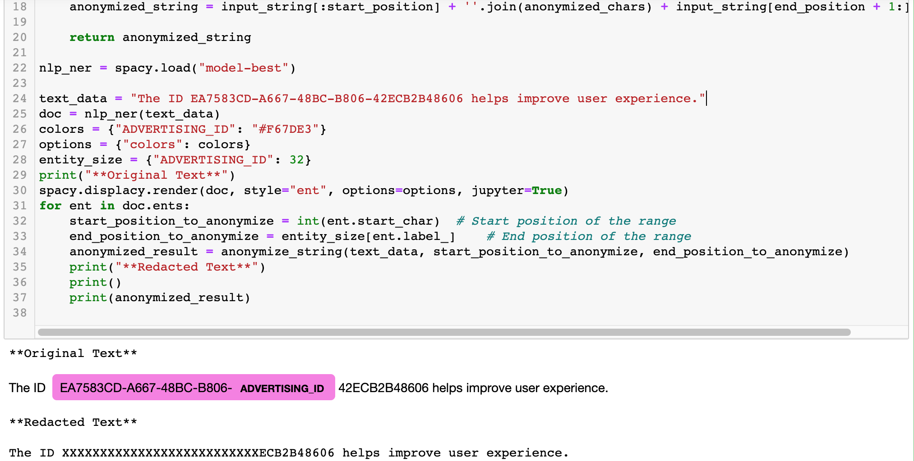

# Anonwise
"Anonwise" is a tool designed to enhance data privacy and security when working with Language Model (LLM). The project focuses on data anonymization, a crucial step in safeguarding sensitive information before it is utilized by LLMs and GPTs for various applications  of text generation.

| Sample notebook with anonimize |
| --------------------------------------------------  |
|  |


# Commands

## Openeval [ Repo ](https://github.com/sundi133/openeval) (Step 1 & 2 for data generation)

``` bash 
1) curl -X POST http://localhost:8000/generate/ \                                                                        
-F "file=@data/fixtures/ner/credit_card_entities.json" \
-F "number_of_questions=1" \
-F "sample_size=50" \
-F "prompt_key=prompt_key_ner_sentences" \
-F "llm_type=.ner"

2) curl -OJ http://localhost:8000/download/c5203e56137246289b9203e773b44f11
```

## Anonwise
``` bash
1) poetry run python -m spacy download en_core_web_sm  

2) poetry run src/data_processing.py --input_file ../llm-datacraft/c5203e56137246289b9203e773b44f11.json --output ./train_credit_card.spacy 

3) poetry run python -m spacy init fill-config config/base_config.cfg config.cfg

4) poetry run python -m spacy train config/base_config.cfg --output ./output --paths.train ./train_credit_card.spacy --paths.dev ./train_credit_card.spacy

5) Update .env with SPACY_MODEL_PATH="./output_credit_card/model-best"

6) docker compose up --build

Application startup complete.

```

## License

This project is licensed under the Apache 2.0 License - see the [LICENSE](LICENSE) file for details.

---